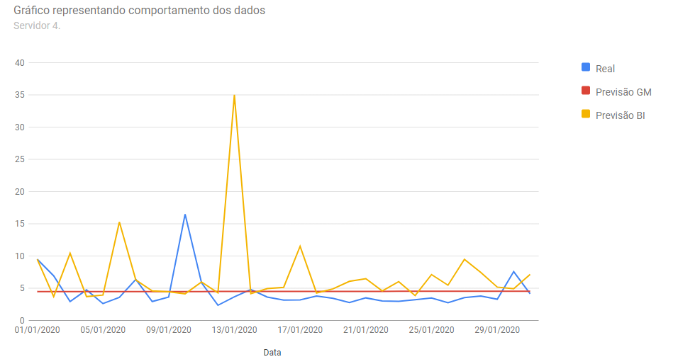
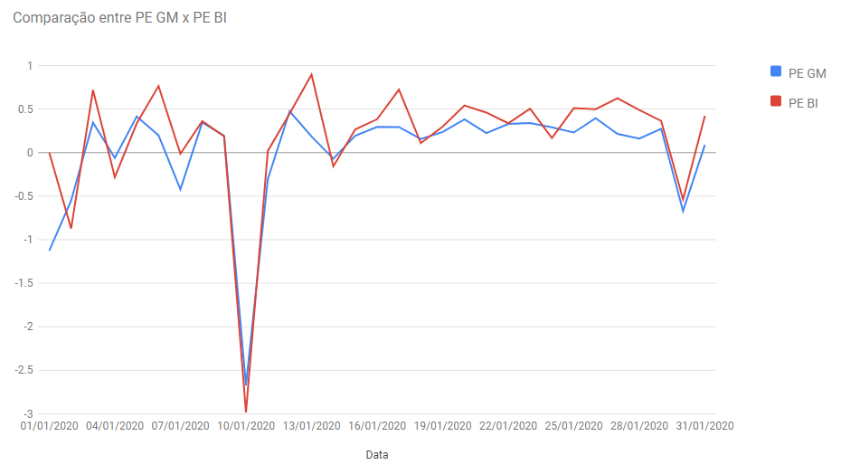

# Forecast Compare

Validação de uma Ferramenta de Business Intelligence (BI) com Métodos Preditivos para Auxiliar a Tomada de Decisão em um Ambiente de Nuvem de Pequenas e Médias Empresas.
Abaixo exemplos dos gráficos gerados a partir de uma entrada de dados variável.

## Gráfico comparação Real vs GM vs BI 

## Gráfico comparação PE GM vs PE BI

